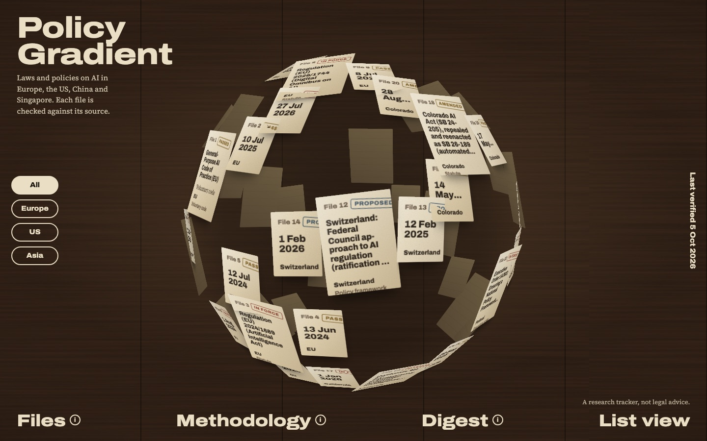
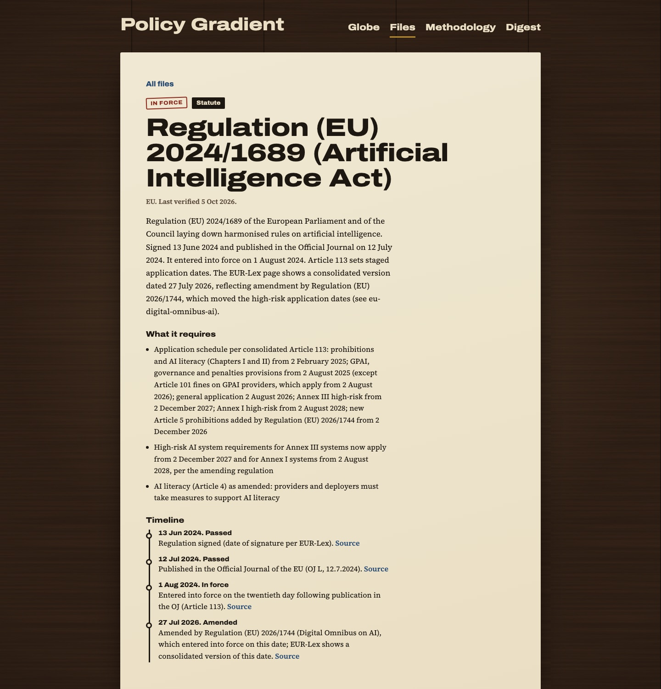

# Policy Gradient

A tracker of AI regulation in **Europe (the EU and Switzerland), the United States, China and Singapore**. Every law and policy gets its own file, and every file is checked against its sources by an independent reviewer before it is published.



The home page is a globe made of paper sheets. Each sheet is a real record: a law or policy, a dated milestone in its history, or a news item. Hover to turn the globe, drag to spin it, click a sheet to open its file.

Most trackers are link dumps. This one is built to be **structured, sourced and reviewed**, and to say plainly what each thing *is* and how far along it is.



## What is in it

- **Laws and policies** ("instruments"), each with a status (proposed, in force, amended and so on), a type (statute, regulation, executive order, guidance, voluntary code or policy framework), its key obligations, and a timeline where every entry links to its source.
- **News items**, linked to the law they concern, each with a confidence rating.
- **A weekly digest** with an RSS feed.
- **A Methodology page** that explains how a file is made and the limits of the data.

It is a starting set, not a complete one. Everything is a snapshot: each file records what its sources said on the date it was last verified. **This is a research tracker, not legal advice.**

## How the content is made

Content is researched and checked by AI agents (Claude Code subagents), and the pipeline is designed so that a person approves every change before it is published.

1. A **researcher** agent per region reads primary sources (official journals, legislature pages, regulator publications). The regions are researched in parallel and independently, so none anchors on another's findings.
2. A separate **reviewer** agent, starting with a fresh context, re-fetches every cited source and checks that the claim, dates, status, source type and tone hold up. It answers accept, revise or reject. Revisions go back to the researcher, up to three rounds. Anything not accepted is never published.
3. An **editor** agent merges the accepted material, links news to the laws it concerns and drafts the digest.
4. **Automated checks** validate the schema, duplicates, internal links and that every cited URL is live.
5. A **person reviews the diff** before it is committed.

The agent definitions are in [.claude/agents/](.claude/agents/), the orchestration command is [/research-run](.claude/commands/research-run.md), and the rules every agent follows are in [docs/research-protocol.md](docs/research-protocol.md). The raw findings and review verdicts for every run are kept in `content/runs/` as provenance.

## Built with

- **Next.js 16** (App Router), React 19, TypeScript and Tailwind CSS 4, exported as a fully static site
- **Content as files in git**, with no database. Git history is the audit trail.
- **Zod** schemas, so agent output must validate before it can enter the content
- The globe is **plain CSS 3D**, so every sheet is real, accessible text. A list view shows the same content as ordinary HTML.
- **Node's built-in test runner** for the logic in `site/lib/`, written test-first

## Run it locally

You need Node 20 or later.

```bash
cd site
npm install
npm run dev       # development server on http://localhost:3000
```

```bash
npm test                # unit tests
npm run validate        # check every content file against its schema
npm run validate:links  # also check that every cited URL is live
npm run build           # static export to site/out/
npm run preview         # serve the export on http://localhost:4173
```

For a deployed build, set `SITE_URL` (for example `SITE_URL=https://example.org npm run build`) so the RSS feed has absolute links.

## Project layout

```
content/      the data: instruments, items, digests, and the provenance of every run
docs/         spec.md (the product spec and phase plan) and research-protocol.md
.claude/      the agent definitions and the /research-run command
.planning/    design tokens
site/         the Next.js app, its tests and scripts
```

## Status

The home page, the Files archive, instrument and news item pages, Methodology and the Digest are built. Not built yet: a compare matrix, search, jurisdiction pages and a first full news run. See [docs/spec.md](docs/spec.md) for the plan, and [CLAUDE.md](CLAUDE.md) for notes on working in the repo.
